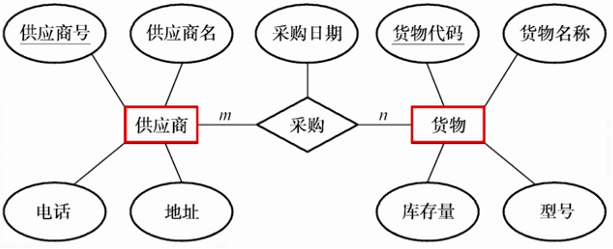

# 一.数据库基础知识
### 数据库技术的发展
**人工管理阶段**

特点:
1. 数据不保存
2. 由程序管理数据
3. 数据有冗余,无法实现共享
4. 数据对应用程序不具有独立性

**文件管理阶段**

特点:
- 数据可以长期保存
- 数据对应用程序有一定的独立性
不足:
- 数据的冗余度大
- 数据独立性不强
- 数据之间缺乏有机的联系

### 数据库系统
**数据库系统的组成**
- 应用程序(最终用户)->开发工具(开发人员)->数据库管理系统(数据库管理员)->操作系统->数据库->计算机硬件
- 操作系统是其他软件运行的基础
- 数据库管理系统实现对数据的统一控制和管理
- 系统开发工具是指编程工具
- 数据库应用程序是指面向数据处理的一类程序
- 数据库系统的有关人员主要有3类:最终用户,开发人员和数据库管理员(Database Administrator,DBA)

**数据库的三级模式结构**:
- 外模式到概念模式的映射:
  - 保证了数据与应用程序间的逻辑独立性
- 概念模式到内模式的映射

### 数据模型
客观事物(现实世界) -抽象-> 概念模型(观念世界) -转换-> 数据库管理系统支持的数据模型(机器世界)

**几个概念:**
- 实体(Entiy):现实世界中客观事物
- 属性(Attribute):实体的特征
- 实体集(Entity Set):同类实体的集合
- 实体类型(Type):实体的结构描述,通常是实体名和属性名的集合.例如:学生(学号,姓名,性别)
- 实体值(Value):属性值的集合.例如,学生"张三"的实体值是:(S001,张三,男)

**实体间的联系(Relationship):**
- 对一的联系
  - 如果对于实体间A中的每个实体,实体集B中最多只有一个实体与之联系,反之亦然,则称实体集A与实体集B具有一对一联系,记为1:1
  - eg:一个乘客只能有一个座位,一个座位只能被一个乘客占有
- 一对多的联系
  - 如果对于实体集A中的每一个实体,实体集B中可以有多个实体与之联系,反之,对于实体集B中的每个实体,实体集A中至多只有一个实体与之联系,则称实体集A与实体集B有一对多联系,记为1:n
  - eg:一个公司有很多员工,但一个员工只能在一个公司就职
- 多对多的联系
  - 如果对于实体集A中的每一个实体,实体集B中可以有多个实体与之联系,而对于实体集B中的每一个实体,实体集A中也可以有多个实体与之联系,则称实体集A与实体集B之间有多对多联系,记为m:n
  - eg:一个供应商可以提供多种货物,但每种货物可以由不同的供应商提供

**E-R图**
- 用矩形框表示现实世界中的实体
- 用菱形框表示实体间的联系
- 用椭圆形框表示实体和联系的属性

**逻辑模型:**
- 层次模型
	- 用树形结构来表示实体及其之间的联系
	- 特点:
		- 由一个节点没有父结点,这个结点即根结点
		- 其他节点有且仅有一个父结点
- 网状模型
    - 用网状结构来表示实体及其之间的联系
    - 特点:
        - 可以有一个以上的结点无父结点
		- 至少有一个结点有多于一个的父结点
- 关系模型
	- 用二维表格来表示实体及其相互之间的联系

**关系模型:**
- 关键字:关系中能唯一区分,确定不同元组的单个属性或属性组合,称为该关系的一个关键字(Key).关系中的关键字可能有多个,都称为候选关键字(Candidate Key).在候选关键字中选定一个作为关键字,称为该关系的主关键字或主键(Primary Key).
- 外部关键字:如果关系中某个属性或属性组合是另一个关系的关键字,则称这样的属性或属性组合为本关系的外部关键字或外键(Foreign Key)
- eg:学生(学号,姓名,性别,专业名称) 专业(专业名称,成立时间,负责人)

**小结:**
- 实体,属性和实体之间的联系是构成E-R图的基本要素.
- 实体之间的联系有三种类型:一对一(1:1),一对多(1:n)和多对多(m:n)
- 逻辑模型有层次模型,网状模型和关系模型三种
- 关系模型用二维表格来表示实体及其相互之间的联系

### 关系数据库