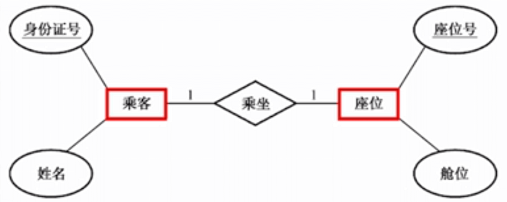
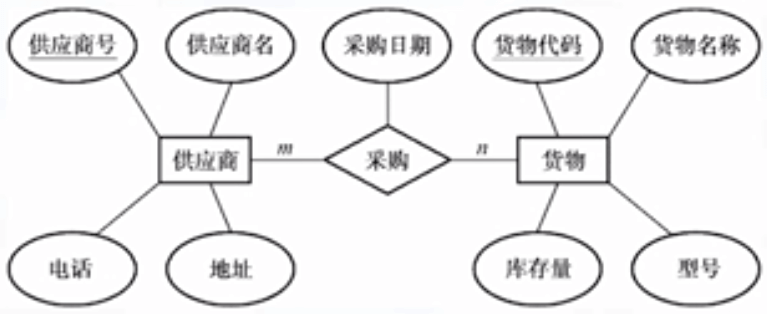

# 一.数据库基础知识
### 数据库技术的发展
**人工管理阶段**

特点:
1. 数据不保存
2. 由程序管理数据
3. 数据有冗余,无法实现共享
4. 数据对应用程序不具有独立性

**文件管理阶段**

特点:
- 数据可以长期保存
- 数据对应用程序有一定的独立性
不足:
- 数据的冗余度大
- 数据独立性不强
- 数据之间缺乏有机的联系

### 数据库系统
**数据库系统的组成**
- 应用程序(最终用户)->开发工具(开发人员)->数据库管理系统(数据库管理员)->操作系统->数据库->计算机硬件
- 操作系统是其他软件运行的基础
- 数据库管理系统实现对数据的统一控制和管理
- 系统开发工具是指编程工具
- 数据库应用程序是指面向数据处理的一类程序
- 数据库系统的有关人员主要有3类:最终用户,开发人员和数据库管理员(Database Administrator,DBA)

**数据库的三级模式结构**:
- 外模式到概念模式的映射:
  - 保证了数据与应用程序间的逻辑独立性
- 概念模式到内模式的映射

### 数据模型
客观事物(现实世界) -抽象-> 概念模型(观念世界) -转换-> 数据库管理系统支持的数据模型(机器世界)

**几个概念:**
- 实体(Entiy):现实世界中客观事物
- 属性(Attribute):实体的特征
- 实体集(Entity Set):同类实体的集合
- 实体类型(Type):实体的结构描述,通常是实体名和属性名的集合.例如:学生(学号,姓名,性别)
- 实体值(Value):属性值的集合.例如,学生"张三"的实体值是:(S001,张三,男)

**实体间的联系(Relationship):**
- 对一的联系
  - 如果对于实体间A中的每个实体,实体集B中最多只有一个实体与之联系,反之亦然,则称实体集A与实体集B具有一对一联系,记为1:1
  - eg:一个乘客只能有一个座位,一个座位只能被一个乘客占有
- 一对多的联系
  - 如果对于实体集A中的每一个实体,实体集B中可以有多个实体与之联系,反之,对于实体集B中的每个实体,实体集A中至多只有一个实体与之联系,则称实体集A与实体集B有一对多联系,记为1:n
  - eg:一个公司有很多员工,但一个员工只能在一个公司就职
- 多对多的联系
  - 如果对于实体集A中的每一个实体,实体集B中可以有多个实体与之联系,而对于实体集B中的每一个实体,实体集A中也可以有多个实体与之联系,则称实体集A与实体集B之间有多对多联系,记为m:n
  - eg:一个供应商可以提供多种货物,但每种货物可以由不同的供应商提供

**E-R图**
- 用矩形框表示现实世界中的实体
- 用菱形框表示实体间的联系
- 用椭圆形框表示实体和联系的属性

**逻辑模型:**
- 层次模型
	- 用树形结构来表示实体及其之间的联系
	- 特点:
		- 由一个节点没有父结点,这个结点即根结点
		- 其他节点有且仅有一个父结点
- 网状模型
    - 用网状结构来表示实体及其之间的联系
    - 特点:
        - 可以有一个以上的结点无父结点
		- 至少有一个结点有多于一个的父结点
- 关系模型
	- 用二维表格来表示实体及其相互之间的联系

**关系模型:**
- 关键字:关系中能唯一区分,确定不同元组的单个属性或属性组合,称为该关系的一个关键字(Key).关系中的关键字可能有多个,都称为候选关键字(Candidate Key).在候选关键字中选定一个作为关键字,称为该关系的主关键字或主键(Primary Key).
- 外部关键字:如果关系中某个属性或属性组合是另一个关系的关键字,则称这样的属性或属性组合为本关系的外部关键字或外键(Foreign Key)
- eg:学生(学号,姓名,性别,专业名称) 专业(专业名称,成立时间,负责人)

**小结:**
- 实体,属性和实体之间的联系是构成E-R图的基本要素.
- 实体之间的联系有三种类型:一对一(1:1),一对多(1:n)和多对多(m:n)
- 逻辑模型有层次模型,网状模型和关系模型三种
- 关系模型用二维表格来表示实体及其相互之间的联系

### 关系数据库
**关系的性质**
- **每个属性都必须是不可再分的数据项(基本规范)**
- 每个属性都具有相同的数据类型
- 关系中不允许出现相同的属性名
- 在关系中不允许有完全相同的元组
- 关系中元组的次序无关紧要
- 关系中属性的次序无关紧要

**关系运算**
- 传统的关系运算:以元组为集合元素的集合运算
  - 并 交 差
  - R和S的**并**(记作R∪S)包含了所有分属于R和S或同属于R和S的元组
  - R和S的**交**(记作R∩S)包含了所有同属于R和S的元组(R∩S=R-(R-S)或S-(S-R))
  - R和S的**差**(记作R-S)包含了所有属于R但不属于S的元组
  - **笛卡尔积**:设R是一个包含m个元组的j元关系,S是一个包含n个元组的k元关系,则R和S的笛卡尔积是一个包含m×n个元组的j+k元关系,记作R×S，并定义R×S={(r~1~,r~2~,...,r~j~,S~1~,S~2~,...,S~k~)|(r~1~,r~2~,...,r~j~)∈R}且{S~1~,S~2~,...,.S~k~}∈S}

eg:设R={(湖南,长沙),(河北,石家庄),(陕西,西安)},S={(湖北,武汉),(广东,广州),(广东,深圳),(陕西,西安)},求R∪S,R∩S,R-S

- 专门的关系运算:
  - 选择 投影 连接
  - **选择(Selection)**:在关系R中挑选满足条件F的元组组成一个新的关系
  - **投影(Projection)**:从关系R中挑选若干属性组成新的关系
  - **连接(Join)**:从两个关系的笛卡尔积中选取属性间满足一定条件的元组组成的新关系
    - 等值连接:从关系R与关系S的笛卡尔积中选取A和B属性值相等的那些元组
    - 自然连接:要求在结果中把重复的属性去掉

**关系完整性**
- **关系完整性规则**:指关系的主属性不能取空值(`NULL`),并且不允许两个元组的关键字值相同(也称为:行完整性)
- **参照完整性规则**:定义两个关系之间的引用规则
  - eg:选课(学号(外部关键字),课程编号,成绩) -> 参照学生关系中的学号 -> 学生(学号(主关键字),姓名,性别)
- **用户自定义完整性规则**:用户对数据必须满足的语义要求作出给定

**小结**
- 关系数据库是关系的集合,而关系是元组的集合
- 通常的关系运算包括并,交,差,笛卡尔积,选择,投影和连接等
- 数据完整性分为实体完整性,参照完整性和自定义完整性三种

### 数据库的设计
**数据库设计的基本步骤**
1. 需求分析(明确目标需求)
2. 概念设计(设计概念模型(常用工具:E-R图))
3. 逻辑设计(设计逻辑模型)
4. 物理设计(设计物理存储结构)
5. 实施与维护(建立数据库,评估与完善)

**E-R模型到关系模型的转换**
- 1:1联系的转换
  - 在两个实体关系的任意一个关系中增加另一个关系的关键属性
  > - 乘客(<u>身份证号</u>,姓名)
  > - 座位(<u>座位号</u>,舱位) ->
  > - 乘客(<u>身份证号</u>,姓名,**座位号**)
  > - 座位(<u>座位号</u>,舱位)
- 1:n联系的转换
  - 在n方实体关系中增加一方实体关系的关键属性和联系的属性
  
  > - 公司(<u>公司名称</u>,注册地,网址)
  > - 员工(<u>员工编号</u>,姓名,基本工资,**数量**,公司名称)
- m:n联系的转换
  - 除对两个实体分别进行转换外,还要为联系单独建立一个关系,其属性为两方实体关系的关键属性加上联系的属性

  > - 供应商(<u>供应商号</u>,供应商名,地址,电话)
  > - 货物(<u>货物代码</u>,货物名称,型号,库存量)
  > - 采购(<u>供应商号</u>,<u>货物代码</u>,采购日期)

  **数据库设计实例**
  教学管理数据库
  - 每名学生只能在某一专业学习,可同时选修多门课程
  - 每门课程可有多位教师讲授,每位教师可讲授多门课程
  - 一门课选用一种教材,一种教材也只能在一门课中使用

  分析:系统涉及五个实体
  > - 学生(<u>学号</u>,姓名,性别)
  > - 课程(<u>课程号</u>,课程名,学时)
  > - 教师(<u>教师号</u>,姓名,性别,职称)
  > - 专业(<u>专业名</u>,成立年份,专业简介)
  > - 教材(<u>教材号</u>,教材名,出版社,定价)
  
  实体之间的联系:
  > - 学生与课程的联系是多对多联系(m:n)
  > - 教师与课程的联系是多对多联系(m:n)
  > - 专业与学生的联系是一对多联系(1:n)
  > - 课程与教材的联系是一对一联系(1:1)

  

  **小结**
  - 数据库设计一般分为需求分析,**概念设计,逻辑设计**,物理设计,数据库实施与维护等阶段
  - E-R图数据库概念模型设计的重要工具,可以按照一定规则将E-R模型转换为关系模型

### 专题总结
- 数据管理技术的三个发展阶段的特点
- 数据库系统的组成以及数据库的三级模式结果
- 关系模型的特点
- 关系数据库的基本知识
- E-R模型到关系模型的转换方法