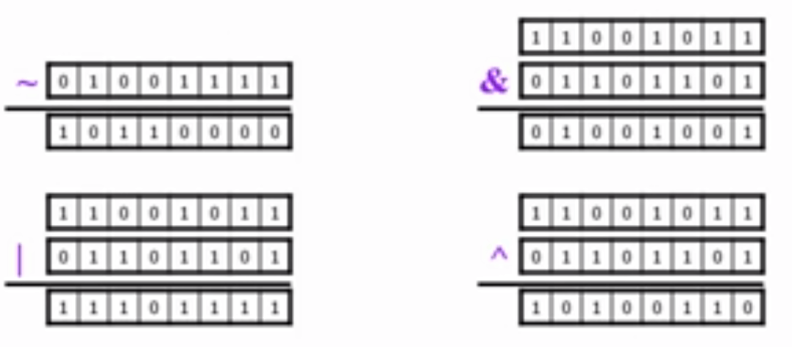

### 1.1 Java历史与发展
**Java三大平台**
- Java SE标准版
- Java EE企业版
- Java ME微型版

**Java的开发工具包:JDK**

**Java发展历程**
- 1995 JDK1.0 初创
- 1998 JDK1.2 Java2
- 2000 JDK1.3 改进
- 2002 JDK1.4 稳定
- 2004 JDK1.5 语法增加
- 2006 JDK1.6 广泛
- 2010 Oracle并购Sun
- 2011 JDK1.7 改进
- 2014 JDK1.8 前进大步

### 1.2 Java语言的特点:C++--
**Java首先是一种编程语言**
- 它是面向对象的编程语言(OOP)
- 它的语法结构与C和C++语言极为相似
- Java所用的语法十分简单

**Java的特点**
- 简单易学
- 面向对象
- 平台无关性
- 安全稳定
- 支持多线程

**Java能做什么**
- 面向对象的应用开发
- 各类网络应用程序的开发
- 计算过程的可视化
- 动态画面/交互操作
- Internet的系统管理
- 数据库操作等

**Java是C++--**
- 无直接指针操作
- 自动内存管理
- 数据类型长度固定
- 不用头文件
- 不包含结构和联合
- 不支持宏
- 不用多重继承
- 无类外全局变量
- 无GOTO

### 1.3 Java运行机制:跨平台的原因
**Java三种核心机制**
- Java虚拟机(Java Virtual Machine)
- 代码安全性检测(Code Security)
- 垃圾收集机制(Garbage collection)

**Java程序的编译与运行**

`Source.java`源程序 -编译javac-> `Source.class`字节码(bytecode)平台无关 -运行java ->

**Java虚拟机(Java Virtual Machine)**
- 在一台计算机上由软件或硬件模拟的计算机
- Java虚拟机(JVM)读取并处理经编译过的字节码class文件
  - Java虚拟机规范定义了:
    - 指令集
    - 寄存器集
    - 类文件结构
    - 堆栈
    - 垃圾收集堆
    - 内存区域

**Java运行环境(JRE)**
- JRE(The Java Runtime Environment)
  - JRE = JVM + API(Lib)
- JRE运行程序时的三项主要功能:
  - 加载代码:由`class loader`完成
  - 校验代码:由`bytecode verifier`完成
  - 执行代码:由`runtime interpreter`完成
- 理解
  - 为什么Java是跨平台的
    - 字节码文件与平台无关,不同的系统都有不同的虚拟机,故可跨平台
  - 为什么Java是安全的
    - 里有代码的校验过程

**JDK(Java开发工具包)**
- JDK = JRE + Tools
- JRE = JVM + API
- 提供的工具
  - `javac.exe`:java编译器
  - `java.exe`:java执行器
  - `javadoc.exe`文档生成器
  - `jar.exe`:java打包器
  - `jdb.exe`:java调试器

### 2.1 面向对象程序设计
**对象**
-在现实世界中:
  - 对象是客观世界中的一个实体
- 在计算机世界中:
  - 对象是一个可标识的存储区域


**类**
- 类:具有共同属性和行为的对象集合
  - 属性:变量(字段field)
  - 行为:函数(方法method)
- 类与对象的关系
  - 类是对象的抽象(模板)
  - 对象是类的实例
    - 注:类和对象都统称"对象",为了明确起见,后者称为"对象实例"

**面向对象的三大特征**
- 封装性
  - 模块化:将属性和行为封装在类中,程序定义很多类
  - 信息屏蔽:将类的细节部分隐藏起来,用户只通过受保护的接口访问某个类
- 继承性
  - 父类和字类之间共享数据和方法
  - 继承的好处
    - 更好地进行抽象与分类
    - 增强代码的重用率
    - 提高可维护性
- 多态性
  - 不同的对象收到同一个消息(调用方法)可产生完全不同的效果
  - 实现的细节则由接收对象自行决定
  - eg
    - `foo(Person p){p.sayHello();}`
    - `foo(new Student());`
    - `foo(new Teacher());`

**面向对象设计思想的要点**
- 认为客观世界由各种对象组成
- 程序的分析和设计都围绕着
  - 有哪些对象类
  - 每个类有哪些属性,哪些方法
  - 类之间的关系(继承,关联等)
  - 对象之间发送消息(调用方法)

### 2.1 Java程序的类型:Java程序的类型及构成
**Application**
- HelloWorld.java
  ```java
  public class HelloWorldApp {
    public static void main(String[] args) {
      System.out.println("Hello World!");
    }
  }
  ```
- 要点
  - class是主体
  - public类名与文件同名
  - main()的写法是固定的
  - System.out.print 及 println 及 printf

**Applet程序**
- HelloWorldApplet.java
  ```java
  import java.awt.*;
  import java.applet.*;
  import javax.swing.*;
  public class HelloWorldApplet extends JApplet {
    public void paint(Graphics g) {
      g.drawString("Hello World!",20,20);
    }
  }
  ```
- 要点
  - import表示导入
  - extends JApplet表示继承
    - Applet或JApplet都可以
  - 有paint()方法,表示如何绘制
  - 没有main()方法

**Java程序的基本构成**
- HelloDate.java
  ```java
  package edu.pku.tds.ch02;
  package java.util.*;
  public class HelloDate{
  ```
- package 语句(0或1句)
- import 语句(0或多句)
  - 导入其他类的类库
- 类定义-class(1或多个)
  - 一个文件只能由一个public类(与文件同名)
- 类=类头+类体
- 类成员=字段(field)+方法(method)
  - 字段(field,属性,变量) 方法(method,函数)
- 方法=方法头+方法体

### 2.1 开发Java 程序的基本步骤:程序的编译与运行
**程序的编辑,编译与运行**
- 源程序编辑
  - 可用任一文本编辑器
- 程序编译
   - 使用JDK中的`javac`工具
- 程序运行
  - 使用`java`工具

**Application的编辑,编译与运行**
 - 程序编辑:编辑器-文件名要与public class的类名一致
   - 区分大小写
 - 程序编译-转换为字节码(bytecode)文件,扩展名.class
   - (.class文件中包括java虚拟机的指令)
   - 编译可以使用JDK工具java.exe
   - 如 javac Hello.java
- 程序的运行-执行.class文件中的指令的过程
  - 如 java Hello
  - (注意:不要写成java Hello.class,因为这里需要的是类名,不是文件名)

**使用package时的编译**
- 文件及路径一致
- 程序中使用package语句
- 使用import语句

**其他几个工具**
- 主要的工具
  - javac 编译
  - java 运行
  - javaw 运行图像界面程序
  - appletViewer运行applet程序
- 另外常用的几个工具
  - jar 打包工具
  - javadoc 生成文档
  - javap 查看类信息及反汇编

### 3.1 基本输入输出编程:文本界面的输入与输出
**输入与输出**
- 应用程序(Java Application)的输入输出可以是文本界面,也可以是图形界面
- 小程序(Java Applet)则只能是图形界面
- 每种界面都可以有输入和输出

**文本界面:使用Scanner类**
- 使用java.util.Scanner类
  - 用其nextInt()方法
  - 还有nextDouble()
  - next()得到下一个单词
  - 注:Since JDK1.5
- ScannerTest.java
  ```java
  import java.util.Scanner;
  class ScannerTest{
    public static void main(String[] args){
      Scanner in = new Scanner(System.in);
      System.out.print("Enter an integer: ");
      int i = in.nextInt();
      System.out.println("You entered: " + i);
    }
  }
  ```

  **文本界面:使用in及out**
  - java.io包
  - System.in.read()
  - System.out.print()及printf,println(类似于CC语言)
  - AppCharInOut.java
      ```java
      char c = ' ';
      System.out.print("Enter a char: ");
      try{
        c = (char)System.in.read();
        }catch(IOException e){
          System.out.println("You have entered: " + e);
        }
  - AppLineInOut.java
    - 输入输出行
    - 更复杂一些
    ```java
    try{
      BufferedReader in = new BufferedReader(new InputStreamReader(System.in));
      s = in.readLine();
      }catch(IOException e){}
  - AppNumInOut.java
    - 输入输出数字
    - 用Integer.parseInt(s);
    - 用Double.parseDouble(s);
    ```java
    BufferedReader in = new BufferedReader(new InputStreamReader(System.in));
    System.out.print("Enter a number: ");
    s = in.readLine();
    n = Integer.parseInt(s);
    ```

### 3.2 基本输入输出编程:图形界面的输入与输出
**图形界面输入与输出**
- 在图形界面下,可以:
  - 使用文本框对象(TextField)获取用户输入的数据
  - 使用标签对象(Label)或文本框输出数据
  - 使用命令按钮(Button)来执行命令

**Java Application图形界面输入与输出**
- Java Application需要首先创建自己的图形界面
- AppGraphInOut.java
- 通过创建一个Frame创建自己的用户界面,在构建AppFrame时,设定该Frame的大小,并用setVisible(true)方法显示出来
- 示例:AppGraphInOut.java
  - add(xxx)加入对象
  - btn.addActionListener:处理事件
  - actionPerformed()函数:具体处理事件
  ```java
  setLayout(new FlowLayout());
  add(in);
  add(btn);
  add(out);
  btn.addActionListener(new BtnActionAdapter());
  class BtnActionAdapter implements ActionListener{
    public void actionPerformed(ActionEvent e){
      String s = in.getText();
      double d = Double.parseDouble(s);
      double sq = Math.sqrt(d);
      out.setText(d + "的平方根是:" + sq);
    }
  }
  ```

**事件处理**
- 在Java8中可简写为:e->{...}
- AppGraphInOut8.java
    ```java
    btn.addActionListener(e->{
      String s = in.getText();
      double d = Double.parseDouble(s);
      double sq = Math.sqrt(d);
      out.setText(d + "的平方根是:" + sq);
    });
    ```

### 3.1.1 数据类型,变量与常量
**数据类型决定数据的存储方式和运算方式**
- Java中的数据类型分为两大类
  - 基本数据类型(Primitive types)
  - 引用类型(reference types)
- 数据类型
  - 基本数据类型
    - 数值型
      - 整数类型(byte,short,int,long)
      - 浮点类型(float,double)
    - 字符型(char)
    - 布尔型(boolean)
  - 引用数据类型
    - 类(class)
    - 接口(interface)
    - 数组

**两种类型的差别**
- 基本类型:变量在栈,在`这里`
- 引用类型:变量引用到堆,在`那里`
  - double d = 3;
  - Person p = new Person();
- 赋值时
  - double d2 = d; 复制的是`值`
  - Person p2 = p; 复制的是`引用`

**Java基本数据类型**
- Java中定义了四类/八种基本数据类型
  - 整数型:byte(1字节),short(2字节),int(4字节),long(8字节)
  - 浮点型:float,double
  - 逻辑型:boolean
  - 字符型:char

**逻辑型**
- boolean类型适于逻辑运算,一般用于程序流程控制
- boolean类型数据只允许取值true或false
  - 不可以0或非0的整数代替true和false
  - **if(a=5)在java中是不允许的**
- 用法举例
    ```java
    boonlean b = false;
    if(b == true)
    {
      //do something
    }

**字符型**
- char型数据用来表示通常意义上的"字符"
- 字符常量是用单引号括起来的单个字符
  - `char c = 'A'`
- **Java字符采用Unicode编码,每个字符占两个字节**
  - 可用十六进制编码形式表示
  - `char c1 = '\u0061';`
- Java语言中还允许使用转义字符"`\`"来将其后的字符转变为其他的含义
  - `char c2 = '\n'; //代表换行符`

**转义符**
- `\ddd` 1到3位八进制数所表示的字符(xxx)
- `\uxxxx` 1到4位十六进制数所表示的字符(xxxx)
- `\'` 单引号字符
- `\"` 双引号字符
- `\\` 反斜杠字符
- `\r` 回车
- `\n` 换行
- `\f'` 走纸换页
- `\t` 横向跳格
- `\b` 退格

**整数类型**
- Java各整数类型有固定的表数范围和字段长度,`而不受具体操作系统的影响`以保证Java程序的可移植性
  |类型|占用存储空间|表数范围|
  |:--:|:--:|:--:|
  |byte|1字节|-128~127|
  |short|2字节|-2^15^~2^15^-1|
  |int|4字节|-2^31^~2^31^-1|
  |long|8字节|-2^63^~2^63^-1|
- Java语言整数常量的三种表示形式:
  - 十进制整数,如12,-32,0
  - 八进制整数,要求以`0`开头,如012
  - 十六进制数,要求`0x`或`0X`开头,如0x12
  - **二进制数**,以`0b`或`0B`开头,如0b00010010(**Java7以上**)
- Java语言的整型常量默认位int型,如:
   - int i = 3;
-  声明long型常量可以后加`l`或`L`,如:
   - long l = 3L;
- **Java中没有"无符号数"**
  - **可以用long来处理无符号整数(unint)**

**浮点型**
- Java浮点类型有固定的表数范围和字段长度
    |类型|占用存储空间|表数范围|
    |:--:|:--:|:--:|
    |float|4字节|-3.403E38~3.403E38|
    |double|8字节|-1.798E308~1.798E308|
- Java浮点类型常量有两种表示形式
  - 十进制数形式,必须含有小数点,例如:3.14,314.0,.314
    - Java7以上:123_456.789_000(**千分位分隔符用下划线表示**)
  - 科学记数法形式,如:3.14e2,314E2,314E2
- Java浮点型常量默认位double型
  - 如要声明一个常量为float型,则需在数字后面加f或F,如
    - double d = 3.14;
    - float f = 3.14f;

**标识符(Identifier)**
- **名字就是标识符**:任何一个变量,常量,方法,对象和类都需要有名字
- 标识符要满足如下规定
  1. 标识符可以由字母,数字和下划线(_),美元符号($)组合而成;
  2. 标识符必须以字母,下划线或美元符号开头,不能以数字开头
- 标识符最好与其意义相符,以增加程序的可读性
- 应注意Java是大小写敏感的语言
  - 按Java惯例,**类名首字母用大写(Pascal)**
  - 其余的(包名,方法名,变量名)**首字母都小写(camel)**
  - 少用下划线
  - 常量随使用随定义

**变量声明和赋值**
```java
public class Test{
  public static void main(String args []){
    boolean b = true; //声明boolean型变量并赋值
    int x,y = 8; //声明int型变量
    float f = 4.5f; //声明float型变量并赋值
    double d = 3.1415; //声明double型变量并赋值
    char c; //声明char型变量
    c = '\u0031'; //为char型变量
    x = 12; //为int型变量赋值
  }
}
```

### 3.2.1 运算符与表达式:运算符
**运算符**
- 算术运算符:`+`,`-`,`*`,`/`,`%`,`++`,`--`
- 关系运算符:`>`,`<`,`>=`,`<=`,`==`,`!=`
- 逻辑运算符:`!`,`&`,`|`,`^`,`&&`,`||`
- 位运算符:`&`,`|`,`^`,`~`,`>>`,`<<`,`>>>`
- 赋值运算符:`=` 扩展赋值运算符:`+=`,`-=`,`*=`,`/=`
- 字符串连接运算符:`+`

**算术运算符:`+`,`-`,`*`,`/`,`%`,`++`,`--`**
- 有关 `/`:`15\5`(**整除**) `15.0/2`(**实数除法**)
- 有关 `%`:`100%3` `100%-3` `-100%-3` `-100%3`
- 有关`%`的含义:偶数`a%2`
- 有关`++`,`--`:
  - `a=5;a++;b=a*2`
  - `a=5;b=++a*2`
  - `a=5;b=a++*2`
- `^`不是乘方

**逻辑运算符**
- 逻辑运算符功能
  - ! 逻辑非 | & 逻辑与 | | 逻辑或
  - ^ 逻辑异或 | &&短路与 | || 短路或
- 逻辑运算符功能说明
  |`a`|`b`|`!a`|`a&b`|`a\|b`|`a^b`|`a&&b`|`a\|\|b`|
  |:--:|:--:|:--:|:--:|:--:|:--:|:--:|:--:|
  |true|true|false|true|true|false|true|true|
  |true|false|false|false|true|true|false|true|
  |false|true|true|false|true|true|false|true|
  |false|false|true|false|false|false|false|false|
- 短路(short-circuit)逻辑运算符
  - `&&` 第一个操作数为假,则不判断第二个操作数
  - `||` 第一个操作数为真,则不判断第二个操作数
  - MyDate d;
- ```java
  if((d!=null)&&(d.day>31)){
    //do something with d
  }
  ```
- ```java
  if(i<0 || i>31){
    System.out.println("非法赋值");
  }
  ```
- 位运算
  - `~`取反,`&`按位与,`|`按位或,`^`按位异或
  - 位运算符功能说明:
    - 

**移位运算符**
- 左移
  - `a<<b`将二进制形式的a逐位左移b位
- 带符号右移
  - `a>>b`将二进制形式的a逐位右移b位,最高位空出的b位补原来的符号位
- 无符号右移
  - `a>>>b`将二进制形式的a逐位右移b位,最高位空出的b位补0
- 移位运算符性质
  - 适用数据类型:byte,short,char,int,long
  - 对低于int型的操作数将先自动转换位int型再移位(**整体提升**,对所有的运算都是这样)
  - 对于int型整数移位`a>>b`,系统先将b对32取模,得到的结果才是真正移位的位数
  - 对于long整数唯一时`a>>b`,则是先将移位位数b对64取模
- 移位运算符应用举例
  |||
  |:--:|:--:|
  |2227=|00000000 00000000 00001000 10110011|
  |2227<<3=|00000000 00000000 01000101 10011000|
  |2227>>3=|00000000 00000000 00000001 00010110|
  |2227>>>3=|00000000 00000000 00000001 00010110|
  |-2227=|11111111 11111111 11110111 01001101|
  |-2272<<3=|11111111 11111111 10111010 01101000|
  |-2227>>3=|11111111 11111111 11111110 11101001|
  |-2227>>>3=|00011111 11111111 11111110 11101001|

**赋值运算符**
- 赋值运算符`=`
  - 当`=`两侧的数据类型不一致时,可以适用默认类型转换或**强制类型转换**(casting)原则进行处理
    - long l = 100;
    - int i = (int)l;
    - 特例:可以将整型常量直接赋值给byte,short,char等类型变量,而不需要进行强制类型转换,只要不超出其表数范围
      - byte b = 12; //合法
      - byte b = 4096; //非法
- 扩展运算符
    |运算符|用法举例|等效的表达式|
    |:--:|:--:|:--:|
    |+=|a+=b|a=a+b|
    |-=|a-=b|a=a-b|
    |*=|a*=b|a=a*b|
    |/=|a/=b|a=a/b|
    |%=|a%=b|a=a%b|
    |&=|a&=b|a=a&b|
    |\|=|a\|=b|a=a\|b|
    |^=|a^=b|a=a^b|
    |<<=|a<<=b|a=a<<b|
    |>>=|a>>=b|a=a>>b|
    |>>>=|a>>>=b|a=a>>>b|

**字符串连接运算符:+**
- `+`除了用于算术加法运算外,还可用于对字符串进行连接操作
  - int i = 300+5;
  - String s = "hello"+"world";
- `+`运算符两侧的操作数中只要有一个是字符串(Sting)类型,系统会自动将另一个操作数转换为字符串然后再进行拼接
  - int i = 300+5;
  - String s = "hello"+i+"号";
  - System.out.println(s); //输出:hello,305号
- **该运算符大大简化了字符串的处理**

### 3.2.2 运算符与表达式:表达式及查看反汇编的代码
**表达式**
- 表达式是符合一定语法规则的运算符和操作数的序列
- 表达式的类型和值
  - 对表达式中操作数进行运算得到的结果称为表达式的值
  - 表达式的值的数据类型即为表达式的类型
- 表达式的运算顺序
  - 首先应按照运算符的优先级从高到低的顺序进行
  - 优先级相同的运算符按照事先约定的结合方向进行

**运算符优先级**

|Associative|Operators|
|:--:|:--:|
|R to L|++ -- ~! (data type)|
|L to R|* / %|
|L to R|+ -|
|L to R|<< >> >>>|
|L to R|< > <= >= instanceof|
|L to R|== !=|
|L to R|&|
|L to R|^|
|L to R|\||
|L to R|&&|
|L to R|\|\||
|R to L|?:|
|R to L|= *= /= %= += -= <<= >>= >>>= &= ^= \|=|

**表达式中的类型转换**
- 当有不同种类的混合运算时:
  - int -> long -> float -> double
- **整体提升**
  - 所有的byte,short,char参与算术运算等转为int

### 3.3.1 流程控制语句:简单语句
**简单语句**
- 最简单的语句
  - 方法调用语句
  - 赋值语句,注意分号;
- 如:
  - System.out.println("hello");
  - a = 3 + x;
  - b = a>0 ? a : -a ;
  - s = TextBox1.getText();
  - d = Integer.parseInt(s);

**程序的注释**
- Java中可以采用三种注释方式:
- //用于单行注释.注释从//开始,终止于行尾
- 